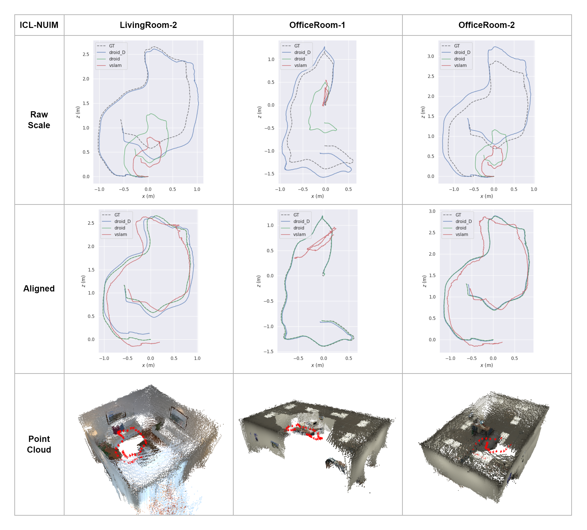
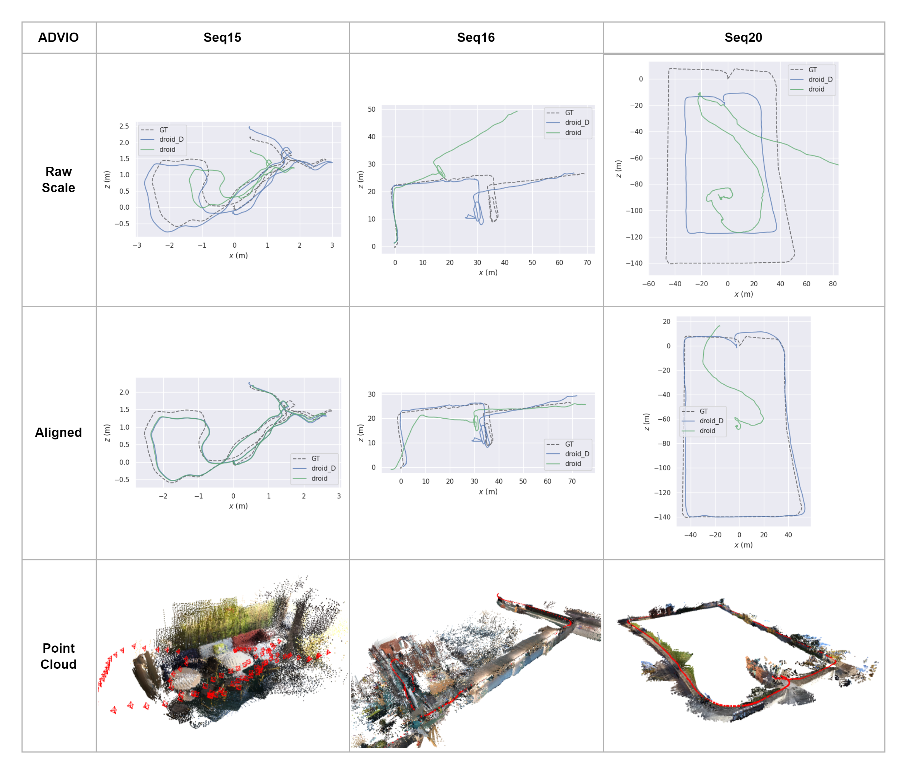
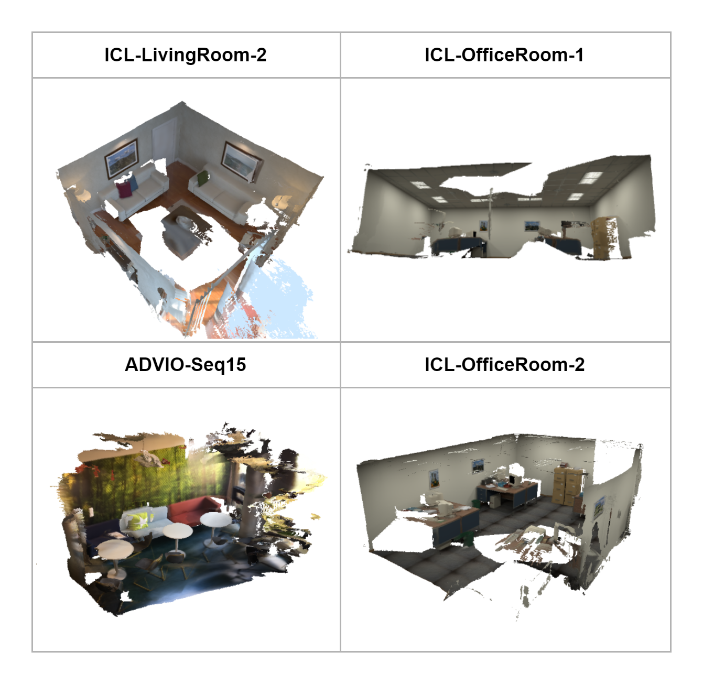

# droid_metric

This repo is for project combind [DROID-SLAM](https://github.com/princeton-vl/DROID-SLAM) and [Metric3D](https://github.com/YvanYin/Metric3D), taking metric depth to improve the performance of DROID-SLAM in monocular mode.

### installation
```bash
# clone the repo with '--recursive' to get the submodules
# or run 'git submodule update --init --recursive' after cloning
cd droid_metric

# create conda env
conda create -n droid_metric python=3.9
conda activate droid_metric

# install pytorch (other versions may also work)
conda install pytorch==2.0.0 torchvision==0.15.0 pytorch-cuda=11.7 -c pytorch -c nvidia

# install python packages
pip install -r requirements.txt

# install droid-slam-backend
cd modules/droid_slam
python setup.py install
cd ../..
```

### usage
###### 1. pretrained models
Download DROID-SLAM and Metric3D pretrained model running
```bash
python download_models.py
```

Download ADVIO dataset running
```bash
python download_dataset.py
```

###### 2. utils
For camera calibration, check `scripts/calib.py`
For video sampling, check `scripts/sample.py`

###### 3. run
```bash
## depth estimate
python depth.py --rgb $/path/to/rgb/dir --out $/path/to/output --intr $/path/to/intrinsic/file
# for more options, check `depth.py`

## droid-slam
python run.py --rgb $/path/to/rgb/dir --depth $/path/to/depth/dir --intr $/path/to/intrinsic/file --viz
# for more options, check `run.py`

## mesh recon
python mesh.py --rgb $/path/to/rgb/dir --depth $/path/to/depth/dir --poses $/path/to/pose/dir --intr $/path/to/intrinsic/file --save $/path/to/output/mesh/ply
# for more options, check `mesh.py`
```

##### 4.scripts
```bash
## test depth estimate, droid slam and mesh reconstruction for rgb image sequence
python -m scripts.test_seq --rgb $/path/to/rgb/dir --depth $/path/to/depth/dir --poses $/path/to/pose/dir --save $/path/to/output/mesh/ply --intr $/path/to/intrinsic/file --viz
```

### experiment
Tested on part of [ICL-NUIM](https://www.doc.ic.ac.uk/~ahanda/VaFRIC/iclnuim.html) and [ADVIO](https://github.com/AaltoVision/ADVIO) dataset. `droid_D` means DROID-SLAM with Metric3D, `droid` mean oroginal DROID-SLAM and `vslam` means the [OpenVSLAM](https://github.com/stella-cv/stella_vslam) framework. Notice that vslam method get lost on ICL-OfficeRoom-1 and all sequences of ADVIO. 

##### trajectory





*(some of the trajectories seem not aligned correctly, sorry for that.)*

##### reconstruction



### preview in the wild


